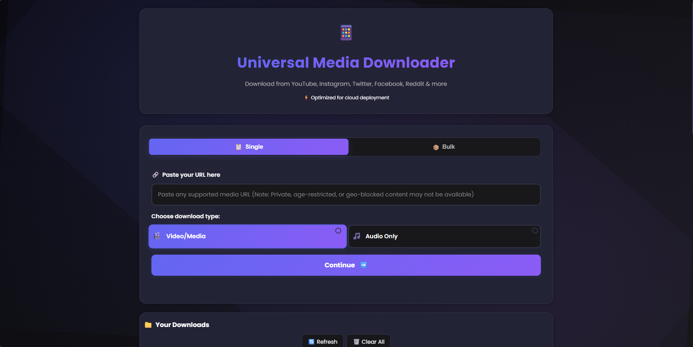
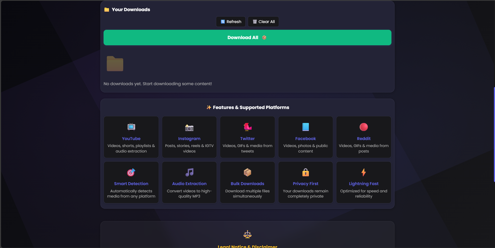
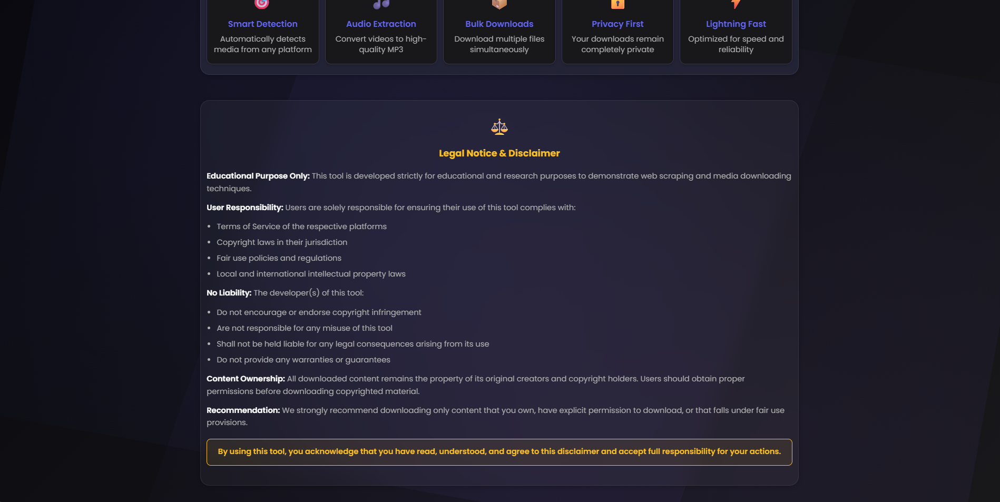
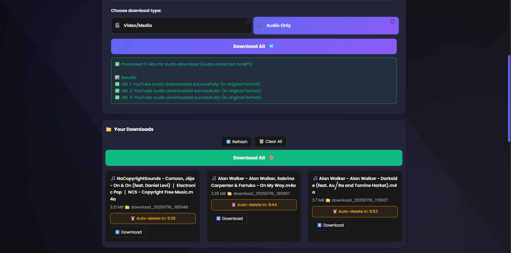
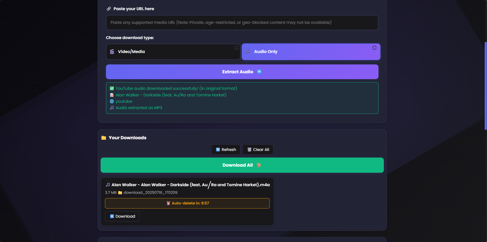
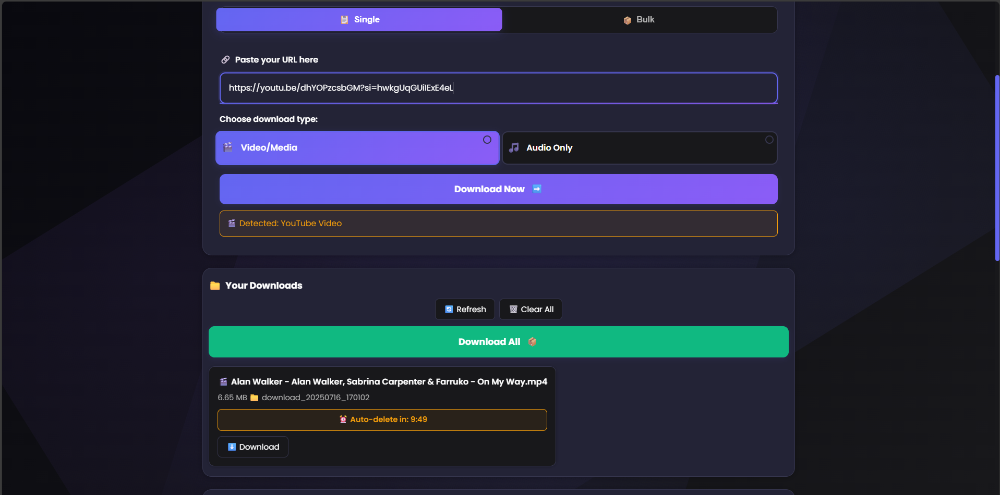
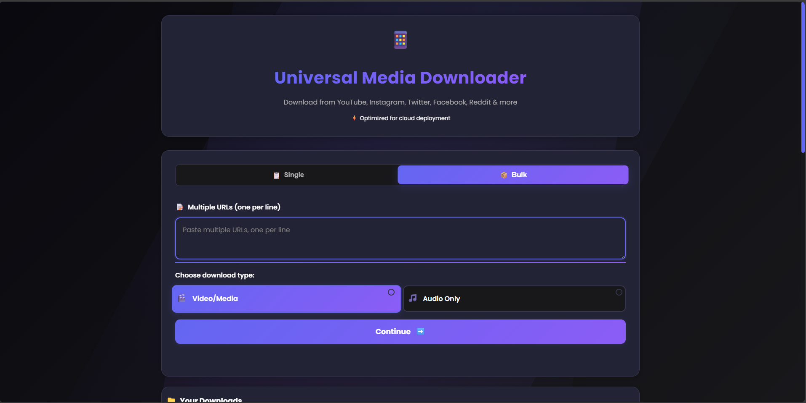
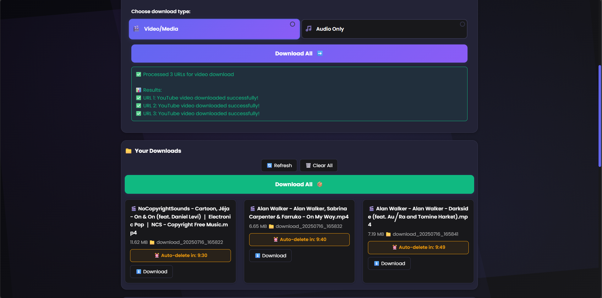

# Overview (For Youtube)

<hr/>


# Eductional Purpose


 # Download Single And Multiple Audio

<hr/>



# Download Single And Multiple Videos 

<hr/>


<hr/>


<hr/>

# Universal Media Downloader

> **🎓 Educational Project Disclaimer**
> 
> This project is developed **strictly for educational and research purposes** to demonstrate web scraping techniques, media processing, and full-stack web development. It showcases the implementation of various technologies including Python Flask, JavaScript, HTML/CSS, and third-party APIs.

## 📖 Overview

Universal Media Downloader is a comprehensive web-based application that demonstrates how to build a multi-platform media downloading system. The project serves as a learning resource for understanding web scraping, media processing, and modern web development practices.

## ✨ Features

### 🌐 Multi-Platform Support
- **YouTube**: Videos, shorts, playlists, live streams (after ending)
- **Instagram**: Posts, stories, reels, IGTV videos
- **Twitter/X**: Videos, GIFs, media from tweets
- **Facebook**: Public videos, photos, posts
- **TikTok**: Videos and audio content
- **Reddit**: Videos, GIFs, media from posts
- **Generic**: Any platform supported by yt-dlp

### 🎵 Audio Extraction
- Convert videos to high-quality MP3 format
- Support for multiple audio formats (MP3, WAV, AAC, OGG, FLAC)
- Automatic audio quality optimization
- FFmpeg integration for advanced audio processing

### 📦 Download Management
- **Single Downloads**: Individual URL processing
- **Bulk Downloads**: Multiple URLs simultaneously (up to 5)
- **Smart Detection**: Automatic platform recognition
- **Real-time Progress**: Live download status updates
- **Auto-cleanup**: Automatic file deletion after 10 minutes

### 🛡️ Security & Privacy
- **User Isolation**: Separate download directories per user
- **Session Management**: Secure user session handling
- **Auto-deletion**: Files automatically removed after download
- **Privacy First**: No user data storage or tracking

### 🎨 User Interface
- **Modern Design**: Clean, responsive interface
- **Tab Navigation**: Easy switching between single and bulk modes
- **Real-time Status**: Live download progress and error messages
- **Animated Elements**: Smooth transitions and visual feedback
- **Mobile Responsive**: Works on all device sizes

### 🔧 Technical Features
- **Cloud Deployment**: Optimized for platforms like Render, Vercel
- **Error Handling**: Comprehensive error detection and user-friendly messages
- **Retry Logic**: Automatic retry on network failures
- **Format Selection**: Best quality format selection
- **Subtitle Support**: Automatic subtitle downloading for supported platforms

## 🚀 Technology Stack

### Backend
- **Python 3.8+**: Core programming language
- **Flask**: Web framework
- **yt-dlp**: Universal media downloader library
- **instaloader**: Instagram-specific downloader
- **FFmpeg**: Media processing (optional)
- **Requests**: HTTP client library

### Frontend
- **HTML5**: Semantic markup
- **CSS3**: Modern styling with animations
- **JavaScript ES6+**: Interactive functionality
- **Responsive Design**: Mobile-first approach

### Dependencies
```
Flask==2.3.3
yt-dlp==2023.10.13
instaloader==4.9.6
requests==2.31.0
Pillow==10.0.1
gunicorn==21.2.0
```

## 📋 Installation

### Prerequisites
- Python 3.8 or higher
- pip package manager
- Git (for cloning)
- FFmpeg (optional, for audio conversion)

### Local Development Setup

1. **Clone the repository**
   ```bash
   git clone <repository-url>
   cd Videos-Downloader
   ```

2. **Create virtual environment**
   ```bash
   python -m venv venv
   source venv/bin/activate  # On Windows: venv\Scripts\activate
   ```

3. **Install dependencies**
   ```bash
   pip install -r requirements.txt
   ```

4. **Run the application**
   ```bash
   python app.py
   ```

5. **Access the application**
   - Open your browser and go to `http://localhost:5000`

### Cloud Deployment (Render)

1. **Fork/Clone the repository**
2. **Connect to Render**
   - Create a new Web Service on Render
   - Connect your GitHub repository
3. **Configure Build Settings**
   - Build Command: `pip install -r requirements.txt`
   - Start Command: `gunicorn app:app`
4. **Deploy**
   - Render will automatically build and deploy

## 🎯 Usage

### Single Download
1. Navigate to the "Single" tab
2. Paste a media URL in the input field
3. Select download type (Video/Media or Audio Only)
4. Click "Download Now"
5. Wait for processing and download the file

### Bulk Download
1. Navigate to the "Bulk" tab
2. Paste multiple URLs (one per line)
3. Select download type
4. Click "Download All"
5. Monitor progress and download files

### File Management
- **View Downloads**: All downloaded files appear in the "Your Downloads" section
- **Auto-deletion**: Files are automatically deleted after 10 minutes
- **Manual Download**: Click individual download buttons
- **Bulk Download**: Use "Download All" to get all files at once
- **Clear All**: Remove all downloads manually

## 🔍 Supported Platforms

| Platform | Video | Audio | Playlists | Live Streams | Notes |
|----------|-------|-------|-----------|--------------|-------|
| YouTube | ✅ | ✅ | ✅ | ✅* | *After stream ends |
| Instagram | ✅ | ❌ | ✅ | ✅ | Audio not supported |
| Twitter/X | ✅ | ✅ | ❌ | ❌ | Individual tweets |
| Facebook | ✅ | ✅ | ❌ | ❌ | Public content only |
| TikTok | ✅ | ✅ | ❌ | ❌ | Individual videos |
| Reddit | ✅ | ✅ | ❌ | ❌ | Public posts |
| Generic | ✅ | ✅ | ✅ | ✅ | Via yt-dlp support |

## 🛠️ Configuration

### Environment Variables
- `FLASK_ENV`: Set to `development` for debug mode
- `SECRET_KEY`: Flask secret key for sessions
- `RENDER_EXTERNAL_HOSTNAME`: Automatically set on Render

### File Structure
```
Videos-Downloader/
├── app.py                 # Main Flask application
├── requirements.txt       # Python dependencies
├── README.md             # This file
├── templates/
│   └── index.html        # Main HTML template
├── static/
│   ├── css/
│   │   └── styles.css    # Styling
│   └── js/
│       └── app.js        # Frontend JavaScript
└── downloads/            # User download directories
    └── [user-sessions]/  # Individual user folders
```

## 🚨 Error Handling

### Common Issues
- **Private/Restricted Content**: Cannot download private or age-restricted content
- **Geo-blocked Content**: Some content may be region-locked
- **Format Availability**: Not all formats available for all platforms
- **Network Timeouts**: Automatic retry logic handles temporary failures

### Platform-Specific Limitations
- **Instagram**: Audio extraction not supported
- **YouTube**: Age-restricted content requires authentication
- **Live Streams**: Must wait for stream to end
- **Private Accounts**: Cannot access private content

## 📊 Performance

### Optimization Features
- **Concurrent Downloads**: Multiple URLs processed simultaneously
- **Smart Caching**: Efficient file handling
- **Auto-cleanup**: Prevents storage overflow
- **Format Selection**: Optimal quality vs. size balance
- **Error Recovery**: Automatic retry on failures

### Resource Management
- **Memory Efficient**: Streaming downloads to prevent memory issues
- **Storage Cleanup**: Automatic file deletion after 10 minutes
- **Session Isolation**: Each user gets separate storage space
- **Bandwidth Optimization**: Smart format selection

## 🔒 Security Considerations

### Data Protection
- **No User Data Storage**: No personal information stored
- **Session Security**: Secure session management
- **File Isolation**: Users can only access their own downloads
- **Auto-cleanup**: Files automatically deleted

### Privacy Features
- **No Tracking**: No user activity tracking
- **Temporary Storage**: All downloads are temporary
- **No Logs**: No user activity logs stored
- **Secure Headers**: Proper security headers implemented

## ⚖️ Legal Disclaimer

### Educational Purpose
This tool is developed **strictly for educational purposes** to demonstrate:
- Web scraping techniques
- Media processing workflows
- Full-stack web development
- API integration methods
- Cloud deployment practices

### User Responsibility
Users are **solely responsible** for ensuring compliance with:
- Terms of Service of respective platforms
- Copyright laws in their jurisdiction
- Fair use policies and regulations
- Local and international IP laws

### No Liability
The developers:
- Do not encourage copyright infringement
- Are not responsible for tool misuse
- Provide no warranties or guarantees
- Accept no liability for legal consequences

### Recommendations
- Download only content you own
- Obtain proper permissions before downloading
- Respect copyright holders' rights
- Use for educational/research purposes only

## 🤝 Contributing

### Development Setup
1. Fork the repository
2. Create a feature branch
3. Make your changes
4. Test thoroughly
5. Submit a pull request

### Code Style
- Follow PEP 8 for Python code
- Use semantic HTML and modern CSS
- Comment complex logic
- Maintain consistency with existing code

## 📝 License

This project is for educational purposes only. Please ensure you comply with all applicable laws and terms of service when using this software.

## 🙏 Acknowledgments

- **yt-dlp**: Universal media downloader library
- **instaloader**: Instagram downloader
- **Flask**: Web framework
- **FFmpeg**: Media processing
- **Open Source Community**: For various libraries and tools

## 📞 Support

For educational purposes and learning:
- Review the code to understand implementation
- Experiment with different features
- Extend functionality for learning
- Use as a reference for similar projects

---

**Remember**: This is an educational project. Always respect content creators' rights and platform terms of service.
